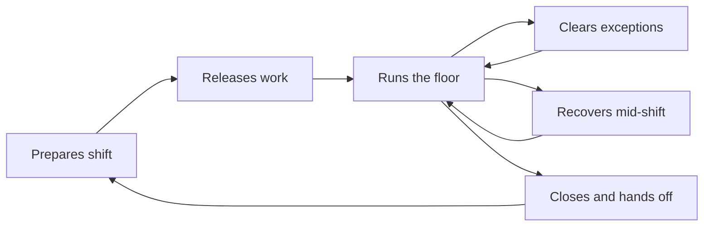
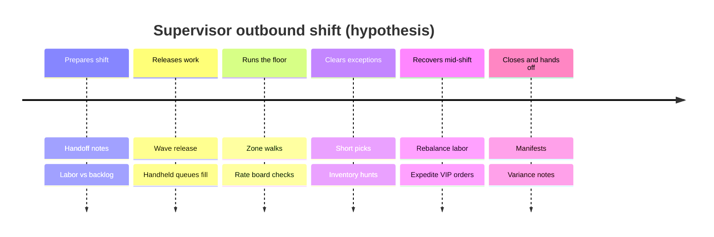

# Customer Journey Map: Warehouse Floor Supervisor — Run a Successful Outbound Shift

## Executive Summary

This map follows a **mid-market warehouse floor supervisor** trying to **hit outbound SLA for the shift** with available labor, accurate inventory, and minimal firefighting. Biggest hypothesized pain points are **exception overload**, **opaque prioritization**, and **late discovery of inventory/labor mismatches**. The critical moment of truth is **mid-shift recovery**: whether the supervisor can rebalance work when orders spike or a zone falls behind — today often via radio and spreadsheets. **All emotions and pain severities are Hypothesis (Low confidence)** until validated with interviews or observation.

## Persona / Segment

**Primary persona (working):** "Sam" — Floor Supervisor at a 30–80 person e-commerce / 3PL fulfillment site. Owns shift outcomes (on-time ship %, pick accuracy, labor hours). Comfortable with handheld WMS apps but currently stitches together WMS screens, walkie-talkies, and Excel for exceptions. Not a data scientist; needs recommendations they can trust and override. (No `foundation-persona` artifact exists yet — this is a provisional segment summary.)

## Journey Scope

- **Journey type:** Cyclical (recurring each shift)
- **Included:** Pre-shift planning → release work → execute outbound → handle exceptions → close shift / handoff
- **Excluded:** Software purchase journey; annual network planning; inbound-only days; carrier contract negotiation

## Stages

| # | Stage | Customer goal | Duration | Entry trigger | Exit criterion |
|---|---|---|---|---|---|
| 1 | Prepares shift | Know demand, labor, and risks before doors open | 20–40 min | Shift start / prior handoff | Work plan and staffing locked |
| 2 | Releases work | Get the right orders to the floor in the right sequence | 15–30 min | Waves/orders ready | Pickers actively tasked |
| 3 | Runs the floor | Maintain flow; hit hourly plan | Ongoing (shift) | First picks start | Steady-state or exception surge |
| 4 | Clears exceptions | Unblock short picks, bad locations, priority orders | Minutes per event; clusters hurt | Exception appears | Order moving again or escalated |
| 5 | Recovers mid-shift | Rebalance when behind or demand spikes | 10–45 min episodes | KPI breach or surge | Plan back on track |
| 6 | Closes & hands off | Accurate inventory and clean backlog for next shift | 20–40 min | Cutoff approaches | Ship commitments met; notes left |

## Touchpoints per Stage

| Stage | Touchpoint | Channel | What happens |
|---|---|---|---|
| Prepares shift | Handoff notes | Chat / whiteboard / WMS comments | Reads overnight issues |
| Prepares shift | Order backlog dashboard | WMS / OMS | Checks volume by carrier cutoff |
| Prepares shift | Labor roster | Spreadsheet / HR tool | Matches heads to zones |
| Releases work | Wave / order release | WMS desktop | Releases batches; hopes prioritization is right |
| Releases work | Handheld task queue | Mobile WMS | Pickers receive work |
| Runs the floor | Zone walk | Physical floor | Spot-checks congestion and idle time |
| Runs the floor | Rate board | Screen / printout | Compares lines/hour to plan |
| Clears exceptions | Short-pick alert | Handheld / radio | Picker reports missing stock |
| Clears exceptions | Inventory lookup | WMS | Supervisor hunts alternate locations |
| Recovers mid-shift | Re-wave / reprioritize | WMS + manual calls | Pulls people between zones |
| Recovers mid-shift | Expedite list | Spreadsheet / Slack | VIP / SLA-risk orders tracked ad hoc |
| Closes & hands off | Shipping manifest | WMS / carrier | Confirms what left the dock |
| Closes & hands off | Cycle count / variance | WMS | Partial counts if time allows |

## Emotional Curve

| Stage | Dominant emotion | Confidence | Source |
|---|---|---|---|
| Prepares shift | Cautious focus, mild anxiety about unknowns | Low | Hypothesis |
| Releases work | Tentative control | Low | Hypothesis |
| Runs the floor | Steady vigilance | Low | Hypothesis |
| Clears exceptions | Frustration, urgency | Low | Hypothesis (common WMS review theme; not primary research) |
| Recovers mid-shift | Stress, cognitive overload | Low | Hypothesis |
| Closes & hands off | Relief or lingering worry about accuracy | Low | Hypothesis |

## Pain Points and Moments of Truth

| Stage | Pain / Moment of Truth | Severity (1-5) | Customer evidence | Implication |
|---|---|---|---|---|
| Prepares shift | Demand and labor risk not in one view | 3 | Hypothesis | AI pre-shift brief is a Phase 1 candidate |
| Releases work | Static waves go stale as orders arrive | 4 | Hypothesis + competitor AI positioning (Manhattan Order Streaming) | Continuous prioritization is differentiation |
| Runs the floor | Travel time and idle time invisible until too late | 3 | Hypothesis | AI task interleaving / pathing |
| Clears exceptions | **Pain:** Exceptions arrive via radio, not system | 5 | Hypothesis | Exception inbox is high-value |
| Clears exceptions | **Moment of Truth:** First major short-pick cluster | 5 | Hypothesis | If AI suggests alternate inventory / re-slot fast, trust forms |
| Recovers mid-shift | **Moment of Truth:** Behind plan with 2 hours to cutoff | 5 | Hypothesis | Make-or-break for supervisor trust in AI recommendations |
| Closes & hands off | Inventory drift discovered too late | 4 | Hypothesis | AI anomaly detection on counts/movements |

## Opportunities

| Stage | Opportunity | Product change that addresses it | Effort (rough) |
|---|---|---|---|
| Prepares shift | AI shift brief | "Today at a glance": volume, labor risk, SKU hotspots | Medium |
| Releases work | Continuous AI prioritization | Dynamic task queue vs static waves | Large |
| Runs the floor | AI-directed paths / interleaving | Reduce travel; balance zones automatically | Large |
| Clears exceptions | Exception copilot | Ranked exceptions + recommended actions + one-tap assign | Medium |
| Recovers mid-shift | Recovery playbooks | "You're 12% behind — move 3 pickers to Zone C" with override | Medium |
| Closes & hands off | Accuracy guardrails | Flag drift locations for targeted counts before handoff | Medium |

### Phase 1 feature signal (from this journey)

Opportunities cluster into three product bets that align with competitive white space:

1. **AI Task Orchestration** — prioritization + pathing during Releases / Runs / Recovers  
2. **AI Exception Copilot** — Clears exceptions + mid-shift recovery assists  
3. **AI Ops Command Center** — Prepares shift + live KPI risk + closeout accuracy signals  

## Visual

### Cyclical journey (mermaid flowchart)

### Linear view of one shift (timeline)

## Research Gaps

- No interviews, ride-alongs, or support-ticket corpus — **entire emotional curve and severities are hypothesized**.
- Does not cover **buyer journey** (evaluation vs CartonCloud / Cin7 / Manhattan) — run a separate pre-purchase map if needed.
- Does not validate whether supervisors will **trust and override** AI recommendations (adoption risk from stakeholder summary).
- Follow-up research that would close the largest gaps:
  1. 5–8 supervisor interviews + 2 shift observations  
  2. Exception taxonomy from real WMS logs or support tickets  
  3. Time-motion on pick path waste and exception aging  

---

*Hypothesis-mode journey map. Do not treat severities as validated prioritization input without research confirmation.*
